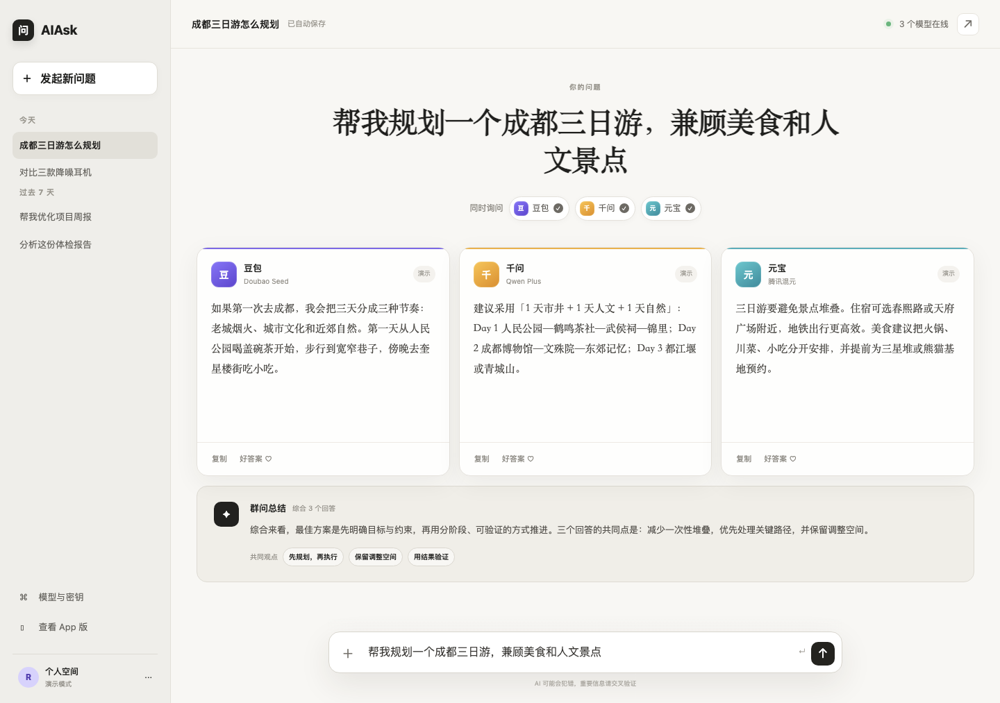
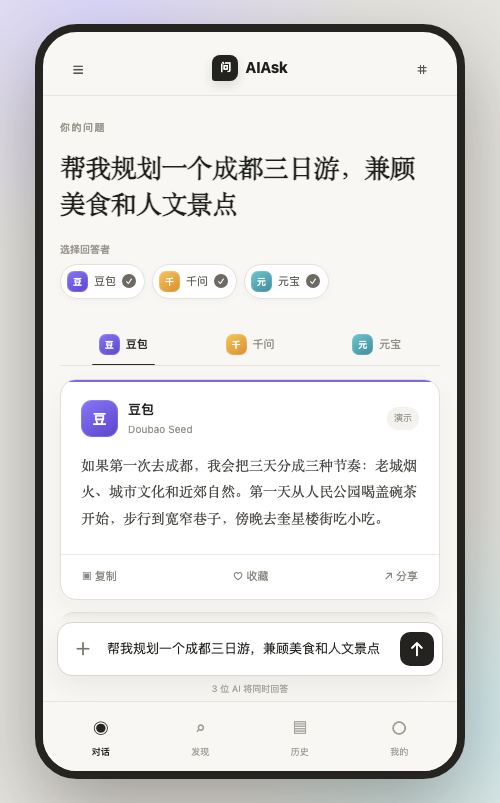

# AIAsk

> 一次提问，多种答案。

AIAsk 是一个面向中文用户的多模型聚合问答应用。同一个问题可以并发发送给豆包、通义千问和腾讯混元，保留每个模型的独立回答，并提供综合结论，方便快速比较不同 AI 的思路。

## 界面预览

### 网页版



### 手机版 / PWA

<p align="center">
  
</p>

## 已实现功能

- 一次提问，同时请求豆包、千问和腾讯混元
- 三栏并排查看模型原始回答
- 单个模型可随时开启或关闭
- 群问总结：提炼共同观点和可执行结论
- 单个提供商失败时自动降级，不影响其他回答
- 未配置 API Key 时自动进入演示模式
- 独立网页版和移动端 PWA 交互
- 响应式布局、复制回答、历史记录和模型状态界面
- 服务端保存密钥，避免 API Key 暴露到浏览器

## 页面入口

| 入口 | 说明 |
| --- | --- |
| `/` | 网页版，多模型答案并排对比 |
| `/mobile` | 手机版 / PWA，标签切换模型答案 |
| `/api/ask` | 服务端统一调度接口 |

## 技术栈

- React 19 + TypeScript
- vinext / Vite
- Cloudflare Worker 兼容服务端
- 原生 Fetch 并发调用 OpenAI 兼容接口
- PWA Web App Manifest

## 快速开始

需要 Node.js `>=22.13.0`。

```bash
git clone https://github.com/MRdabai/aiask.git
cd aiask
npm install
cp .env.example .env.local
npm run dev
```

打开 `http://localhost:3000` 查看网页版，访问 `http://localhost:3000/mobile` 查看手机版。

## 接入真实模型

复制 `.env.example` 为 `.env.local`，填写对应平台的服务端密钥：

```env
# 豆包 / 火山方舟
DOUBAO_API_KEY=
DOUBAO_MODEL=

# 通义千问 / 阿里云百炼
DASHSCOPE_API_KEY=
QWEN_MODEL=qwen-plus

# 元宝底层能力 / 腾讯混元
HUNYUAN_API_KEY=
HUNYUAN_MODEL=hunyuan-turbos-latest
```

密钥为空时，应用仍可完整运行，但返回的是本地演示回答。

## 实现架构

```text
网页版 / 手机 PWA
        │
        │ POST /api/ask
        ▼
服务端统一调度器
   ├── 火山方舟 ──► 豆包
   ├── 阿里百炼 ──► 通义千问
   └── 腾讯混元 ──► 元宝模型能力
        │
        ▼
独立回答 + 综合总结
```

项目调用的是三家官方模型 API，而不是自动登录或抓取豆包、千问、元宝的消费级网页与 App。这种方式更稳定，也便于处理限流、超时、计费和隐私保护。

## 项目结构

```text
app/
├── api/ask/route.ts       # 三家模型并发调度与失败回退
├── components/AIHive.tsx  # 网页版与手机版交互组件
├── mobile/page.tsx        # 手机版 / PWA 入口
├── page.tsx               # 网页版入口
└── globals.css            # 两套界面的完整样式
docs/
├── images/                # 网页版与手机版截图
└── RESEARCH.md            # 方案调研、GitHub 参考与后续建议
public/
└── manifest.webmanifest   # PWA 配置
```

## 构建

```bash
npm run build
```

## 下一步

- SSE 流式输出与停止生成
- 独立汇总模型与分歧点标注
- 会话历史持久化、账号与额度管理
- 图片、文件和联网搜索
- 使用 Capacitor 封装 Android / iOS 安装包

更完整的技术调研见 [`docs/RESEARCH.md`](docs/RESEARCH.md)。

## License

建议在正式开源前补充 LICENSE 文件并确定开源协议。
